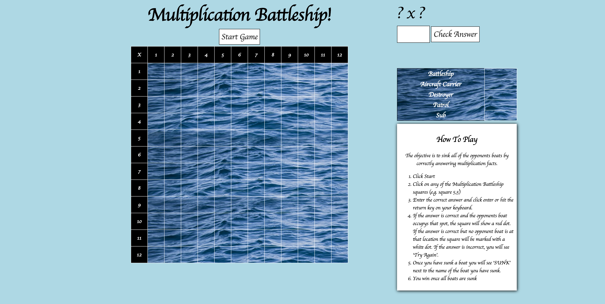

# Multiplication Battleship

# Motivation
This is a take on the classic Battleship game, in this case used to learn multiplication facts. I was shown a version of this game on paper that some students used to practice their multiplication facts. 

I thought it would be fun to turn it into a web version using vanilla JavaScript.

# Tech Used
**Built With**

- Vanilla JavaScript
- CSS

# How to play

1. Click Start
2. Click on any of the Multiplication Battleship squares (e.g. square 5,5)
3. Enter the correct answer and click enter or hit the return key on your keyboard.
4. If the answer is correct and the opponents boat occupys that spot, the square will show a red dot. 
    If the answer is correct but no opponent boat is at that location the square will be marked with a white dot.
    If the answer is incorrect, you will see 'Try Again'.

5. Once you have sunk a boat you will see 'SUNK' next to the name of the boat you have sunk.
6. You win once all boats are sunk